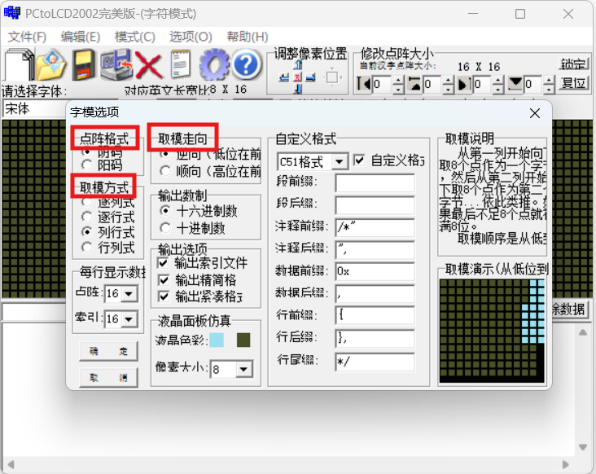

[TOC]

# 【Components】OLED

* [ ] 配置
  * [x] 基础配置
  * [x] 硬件配置
  * [x] 页面填充
  * [x] 硬件配置
  * [ ] 滚动配置
  * [x] 电荷泵
* [ ] 软件实现
  * [x] 初始化
  * [x] 控制屏幕亮灭
  * [x] 内容显示
    * [ ] 逐行式
    * [ ] 逐列式
    * [x] 列行式
    * [ ] 行列式
  * [ ] 屏幕内容滚动

## 1. 前言

## 2. OLED

## 3. 配置介绍

### 3.1 基础配置

| 配置项   | 命令                                     | 数据             | 说明 |
| -------- | ---------------------------------------- | ---------------- | ---- |
| 对比度   | 0x81                                     | 0-255（1个字节） |      |
| 全屏显示 | 0xA4（恢复正常显示）<br>0xA5（点亮全屏） |                  |      |
| 设置反显 | 0xA6（正常显示）<br>0xA7（反显）         |                  |      |
| 显示开关 | 0xAE（关闭显示）<br>0xAF（开启显示）     |                  |      |

### 3.2 硬件配置

| 配置项           | 命令                                                   | 数据                 | 说明                                                         |
| ---------------- | ------------------------------------------------------ | -------------------- | ------------------------------------------------------------ |
| 设置显示起始行   | 0x40 - 0x7F<br> （低6位代表行号，0x00-0x3F，总共64行） |                      | 若值为0, 则RAM第0行映射至COM0, 若值为1, 则RAM第1行映射到COM0, 以此类推。 |
| 段重映射         | A0（colum0 对应 seg0）<br>A1（colum0 对应 seg1）       |                      | 左右反置                                                     |
| 设置复用比       | A8                                                     | 0x00 - 0x3F（低6位） | 同一时间同时导通的COM个数                                    |
| 设置扫描方向     | C0（COM0-COM63）<br>C8（COM63-COM0）                   |                      | 上下反置                                                     |
| 设置显示垂直偏移 | D3                                                     | 0x00 - 0x3F（低6位） | 设置整体显示上下垂直偏移                                     |
| Com引脚硬件配置  | DA                                                     | 0x*2（bit 4 bit5）   | 用于配置硬件布局的，后面再研究                               |

### 3.3 时间/驱动配置

| 配置项                   | 命令 | 数据                                                         | 说明 |
| ------------------------ | ---- | ------------------------------------------------------------ | ---- |
| 设置始终分频和振荡器频率 | D5   | 低四位（时钟分频系数）<br>高四位（振荡器频率）               |      |
| 设置预充电时间           | D9   | 低四位（预充，最多15个Clock，0无效）<br>高四位（反充，最多15个Clock，0无效） |      |
| 设置VCOMH取消选择级别    | DB   |                                                              |      |

### 3.4 页面填充

| 配置项                   | 命令                         | 数据                                                         | 说明 |
| ------------------------ | ---------------------------- | ------------------------------------------------------------ | ---- |
| 页内列地址（低字节）     | 0x00-0x0F                    |                                                              |      |
| 页内列地址（高字节）     | 0x10-0x1F                    |                                                              |      |
| 模式设置                 | 0x20                         | 0x00（水平地址模式）<br>0x01（垂直地址模式）<br>0x02（页地址模式）<br>0x03（无效值） |      |
| 设置列地址               | 0x21                         | 数据1：低七位（列起始地址 0 - 127）<br>数据2：低七位（列结束地址 0 - 127） |      |
| 设置页地址               | 0x22                         | 数据1：低3位（页起始地址 0 - 3）<br>数据2：低3位（页结束地址 0 - 3） |      |
| 设置页模式下的页起始地址 | 0xB0 - 0xB7（低3位表示页号） |                                                              |      |

### 3.5 滚动配置

### 3.6 电荷泵配置

| 配置项 | 命令 | 数据                             | 说明 |
| ------ | ---- | -------------------------------- | ---- |
| 电荷泵 | 0x8D | 0x1X（bit2 - 1：开启   0：关闭） |      |

## 4. 软件实现

### 4.1 oled 对象构建

下图所示为oled驱动对象。

```c
struct oled_driver_t
{
	void(*init)(struct oled_driver_t *oled);
	void(*open)(struct oled_driver_t *oled);
	void(*close)(struct oled_driver_t *oled);
	void(*refresh)(struct oled_driver_t *oled);
	void(*clear)(struct oled_driver_t *oled);
	void(*show)(struct oled_driver_t *oled,
						  uint32_t x, 
							uint32_t y, 
							uint8_t *buffer, 
							uint32_t buffer_size, 
							uint32_t width, 
							uint32_t high, 
							enum oled_module_mode_t mode, 
							enum oled_module_direct_t direct);
	struct i2c_driver_t *driver;
	uint8_t vitual_ram[128][8]; /* 后面再将这个做成用户实现的配置项 */
};
```

oled驱动对象初始化如下所示：oled对象句柄用户持有，调用oled_ssd1306_i2c_init进行初始化，同时需传入i2c驱动进行绑定。

```c
struct oled_driver_t oled;

oled_ssd1306_i2c_init(&oled, &i2c_driver);
```

### 4.2 oled 初始化

调用如下接口进行oled驱动初始化。

```c
oled.init(&oled);
```

初始化接口中的内容如下图所示，按照下述指令对oled进行配置。`实际配置可以根据实际需求进行调整`


### 4.3 内容显示

内容显示就是将数据填入到“显存”z中。

如下图所示，利用字模生成软件，字符'A'会生成如下一串数据，该数据就字模，每个数据中1和0用于控制亮灭。


如下图所示，我们使用取模软件的时候，我们需要设置一些配置项：

* 点阵格式：
  * 阴码：0（灭）1（亮）
  * 阳码：0（亮）1（灭）
* 取模方式：表示每个字模数据取模的方式
* 取模走向：字模的大小端



oled驱动已经将上面的配置做进去了，如下定义的枚举所示，

```c
enum oled_module_mode_t
{
	OLED_MODULE_MODE_1,	/* 逐行式 */
	OLED_MODULE_MODE_2, /* 逐列式 */
	OLED_MODULE_MODE_3,	/* 列行式 */
	OLED_MODULE_MODE_4, /* 行列式 */
};

enum oled_module_direct_t
{
	OLED_MODULE_MSB, /* 顺向 */
	OLED_MODULE_LSB, /* 逆向 */
};

/* 通过如下代码将内容输出到oled，传入的mode和direct参数需要根据生成字模的配置相同 */ 
oled.show(&oled, 0, 0, (uint8_t *)ASCII_8x16_bitmap[16], 16, 8, 16, OLED_MODULE_MODE_3, OLED_MODULE_LSB);
```

