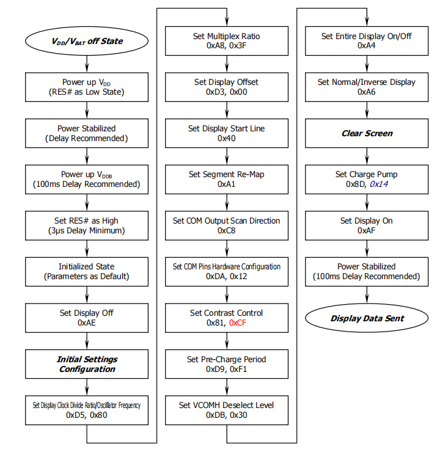
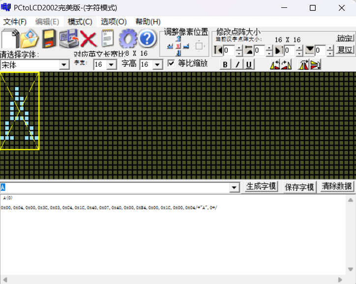

# 【Components】OLED

* [ ] 配置
  * [x] 基础配置
  * [x] 硬件配置
  * [x] 页面填充
  * [x] 硬件配置
  * [ ] 滚动配置
  * [x] 电荷泵
* [ ] 软件实现
  * [x] 初始化
  * [x] 控制屏幕亮灭
  * [ ] 内容显示
  * [ ] 控制翻页
  * [ ] 数值设置
  * [ ] 屏幕内容滚动

## 1. 前言

## 2. OLED

## 3. 配置介绍

### 3.1 基础配置

| 配置项   | 命令                                     | 数据             | 说明 |
| -------- | ---------------------------------------- | ---------------- | ---- |
| 对比度   | 0x81                                     | 0-255（1个字节） |      |
| 全屏显示 | 0xA4（恢复正常显示） 0xA5（点亮全屏） |                  |      |
| 设置反显 | 0xA6（正常显示） 0xA7（反显）         |                  |      |
| 显示开关 | 0xAE（关闭显示） 0xAF（开启显示）     |                  |      |

### 3.2 硬件配置

| 配置项           | 命令                                                   | 数据                 | 说明                                                         |
| ---------------- | ------------------------------------------------------ | -------------------- | ------------------------------------------------------------ |
| 设置显示起始行   | 0x40 - 0x7F  （低6位代表行号，0x00-0x3F，总共64行） |                      | 若值为0, 则RAM第0行映射至COM0, 若值为1, 则RAM第1行映射到COM0, 以此类推。 |
| 段重映射         | A0（colum0 对应 seg0） A1（colum0 对应 seg1）       |                      | 左右反置                                                     |
| 设置复用比       | A8                                                     | 0x00 - 0x3F（低6位） | 同一时间同时导通的COM个数                                    |
| 设置扫描方向     | C0（COM0-COM63） C1（COM63-COM0）                   |                      | 上下反置                                                     |
| 设置显示垂直偏移 | D3                                                     | 0x00 - 0x3F（低6位） | 设置整体显示上下垂直偏移                                     |
| Com引脚硬件配置  | DA                                                     | 0x*2（bit 4 bit5）   | 用于配置硬件布局的，后面再研究                               |

### 3.3 时间/驱动配置

| 配置项                   | 命令 | 数据                                                         | 说明 |
| ------------------------ | ---- | ------------------------------------------------------------ | ---- |
| 设置始终分频和振荡器频率 | D5   | 低四位（时钟分频系数） 高四位（振荡器频率）               |      |
| 设置预充电时间           | D9   | 低四位（预充，最多15个Clock，0无效） 高四位（反充，最多15个Clock，0无效） |      |
| 设置VCOMH取消选择级别    | DB   |                                                              |      |

### 3.4 页面填充

| 配置项                   | 命令                         | 数据                                                         | 说明 |
| ------------------------ | ---------------------------- | ------------------------------------------------------------ | ---- |
| 页内列地址（低字节）     | 0x00-0x0F                    |                                                              |      |
| 页内列地址（高字节）     | 0x10-0x1F                    |                                                              |      |
| 模式设置                 | 0x20                         | 0x00（水平地址模式） 0x01（垂直地址模式） 0x02（页地址模式） 0x03（无效值） |      |
| 设置列地址               | 0x21                         | 数据1：低七位（列起始地址 0 - 127） 数据2：低七位（列结束地址 0 - 127） |      |
| 设置页地址               | 0x22                         | 数据1：低3位（页起始地址 0 - 3） 数据2：低3位（页结束地址 0 - 3） |      |
| 设置页模式下的页起始地址 | 0xB0 - 0xB7（低3位表示页号） |                                                              |      |

### 3.5 滚动配置

### 3.6 电荷泵配置

| 配置项 | 命令 | 数据                             | 说明 |
| ------ | ---- | -------------------------------- | ---- |
| 电荷泵 | 0x8D | 0x1X（bit2 - 1：开启   0：关闭） |      |

### 4. 软件实现

### 4.1 初始化流程

### 4.2 内容显示

内容显示就是将字模数据填入到“显存”中。

如下图所示，字符'A'会生成如下一串数据，该数据就是一个bitmap，发送给oled后可以用来控制像素的亮灭。`注意：这里我们写入到我们维护的显存的时候，要注意数模是自高到低生成的还是自低到高生成。如下图所示，我们写入的顺序就是自上而下，自左到右，数据从低位到高位`

